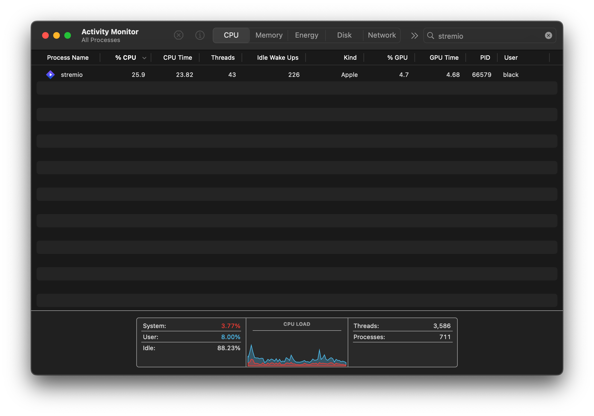
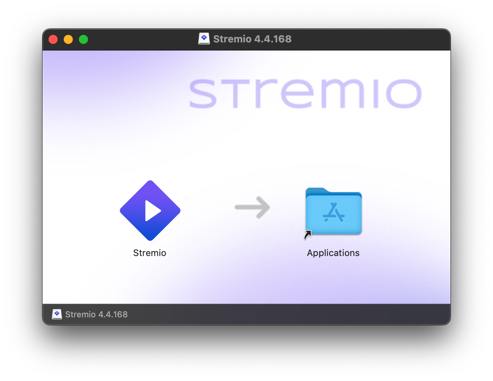

# Stremio for Apple Silicon 

<div align="center">



</div>

## Installation with DMG

Download DMG:
https://github.com/erfansamandarian/stremio-mac/releases/download/v4.4.168/Stremio.4.4.168.dmg

Install dependencies:
```sh
brew install mpv node qt@5 ffmpeg openssl@3 icu4c@75
```

Run: 
```sh
sudo xattr -r -d com.apple.quarantine /Applications/Stremio.app
```

## Installation with Script

### Quickest

```sh
bash -c "$(wget -qLO - https://github.com/erfansamandarian/stremio-mac/raw/master/quick.sh)"
```

(Note: you will have to provide sudo access for finalize.sh and pack.sh)

### Quickish

```sh
git clone https://github.com/erfansamandarian/stremio-mac
```

```sh
cd stremio-mac
```

```sh
chmod +x install.sh
```

```sh
./install.sh` (Note: you will have to provide sudo access for finalize.sh and pack.sh)
```

`Open the .dmg file and drag and drop the Stremio application into your Applications folder`

<div align="center">



</div>
